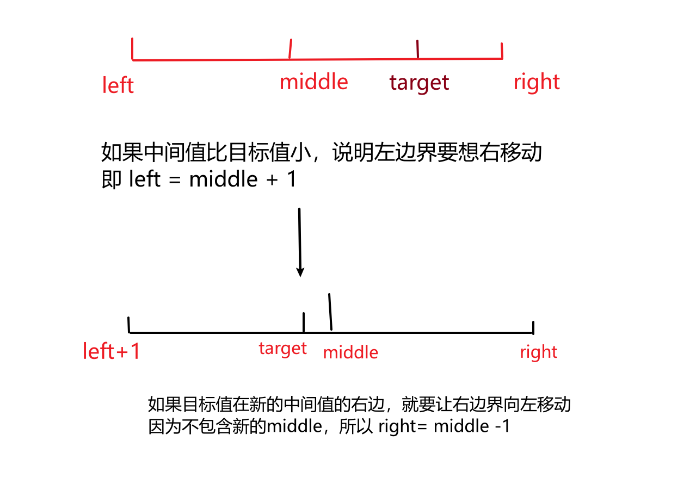

# 704-二分查找

> ## 题目
>
> 给定一个 n 个元素有序的（升序）整型数组 nums 和一个目标值 target  ，写一个函数搜索 nums 中的 target，如果目标值存在返回下标，否则返回 -1。
>


## 二分法简介

`二分法`，也称`折半查找`，是一种在有序数组中查找特定元素的算法。该算法的基本思想是将数组从`中间`分成两部分，判断目标元素应该在哪一部分，然后只在该部分中继续查找，不断缩小查找范围，直到找到目标元素或确定目标元素不存在。

具体的实现步骤如下：

1. 首先，确定数组的中间位置 `mid = (left + right) / 2`。
2. 将目标元素与中间位置的元素进行比较。如果相等，则直接返回中间位置的索引；如果目标元素小于中间位置的元素，则在左半部分继续查找；否则，在右半部分继续查找。
3. 重复步骤 1 和步骤 2，直到找到目标元素或确定目标元素不存在。
4. 二分查找必须适用于`有序`的数组，并且数组中不能出现相同的元素
5.

> 重复执行上述过程，如果找到目标值在数组中，就返回目标值的下标
>
> ​						如果目标值不在数组中，则退出循环，返回-1

## 代码实现

```js
/**
 * @param {number[]} nums
 * @param {number} target
 * @return {number}
 */
var search = function(nums, target) {
    let left = 0 //定义左边起始值
    let right =nums.length - 1 //定义最后一个值
    while(left <= right) {
        //找出数组中间元素
        let middle = Math.floor((left + right) / 2)
        //中间元素与目标元素进行比较
        if(nums[middle] < target) {
            left = middle + 1
        }else if(nums[middle] > target) {
            right = middle -1
        }else {
            return middle
        }
    }
    return -1
};
```

